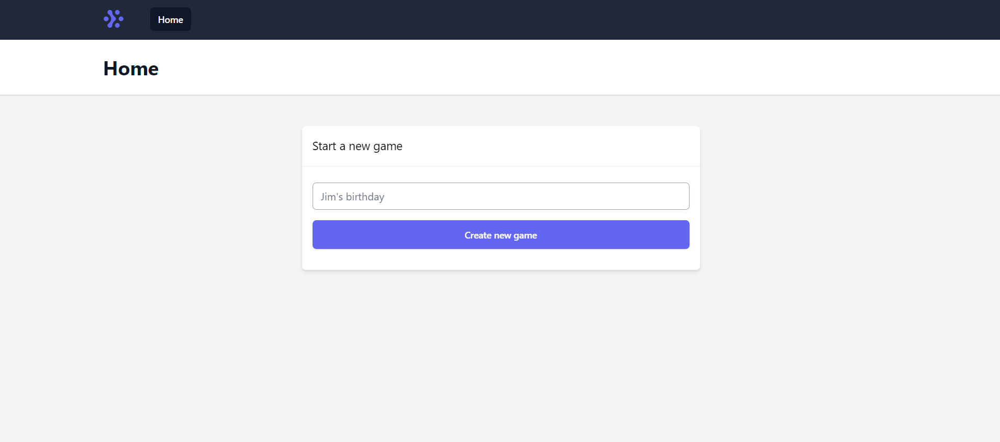
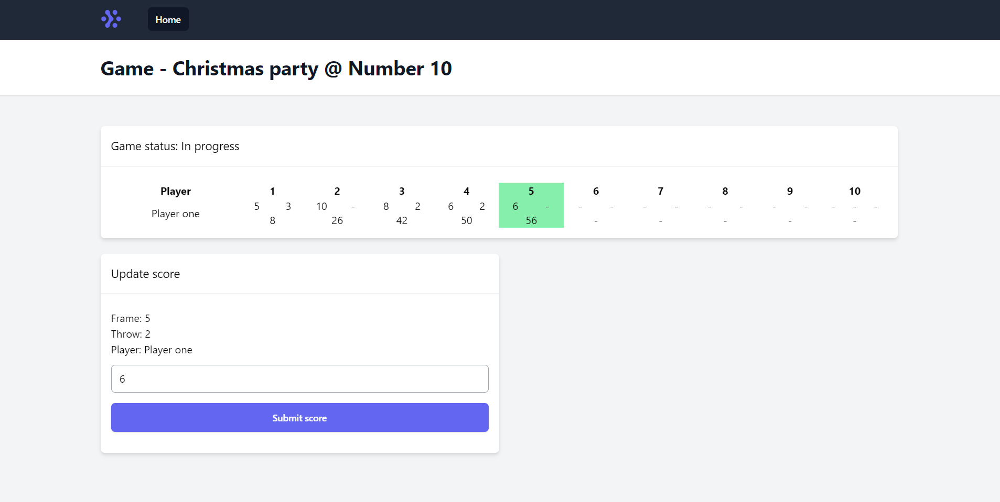

## Larabowl - WIP

Simple laravel app which tracks bowling scores. Set up as a project to have a play with PHP 8, Tailwind CSS and an opportunity to learn how bowling scores work.

### Setup

Note: I have `sail` aliased:
```
alias sail='[ -f sail ] && bash sail || bash vendor/bin/sail'
```

- Pull the repo
- Ensure docker is running and run `bash vendor/bin/sail up -d`
- Run `sail install`
- Run `npm install` - tested on Node 14.15.4
- Run the migrations with `bash vendor/bin/sail migrate`
- Visit localhost
- Bowl!

### Todo
- ~~Scores fall over when you get to Frame 10~~
- Need a way to add additional players
- Need a way to see existing games
- Statuses for games would be nice
- Some UX stuff

### Screenshots




